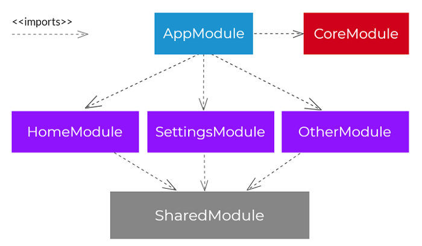

# Shared Folder

It should contain the code that could potentially be reused across your app, usually your Components, Hooks and Helpers. That could be compared to the furnishing of your house when comparing building an app to building a house — the furniture can be reused somewhere else, plus can be moved around the house.

Contrary to the `Core Folder`, code in your shared folder can be imported many times to lots of different modules inside your application.

Because the code inside your `Shared Folder` could be reused many times and, in the future, potentially also in a completely different app, it is favorable to introduce more child modules to your shared module — just remember to keep the modules small and assign them individual responsibilities (such as a module for _forms_, another module for _currency conversion_, another module for _number formatting_, etc.). Extracting a part of your `Shared Folder` with such modular structure into a separate library will be a breeze in the future!
